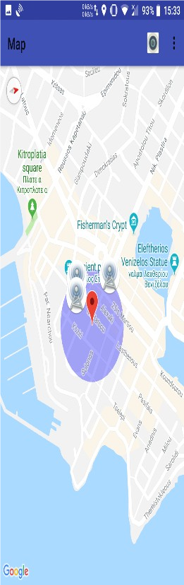

# AntennaAR
Android application in Java that displays cell towers in Augmented
Reality and on Google Maps. It uses a local SQLite database and
converts GPS location coordinates (WSG84) to the ENU system.

  
